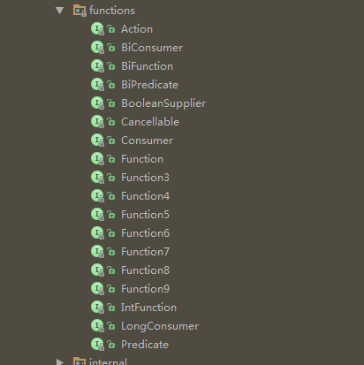

# AyoRxJava
整理一下Rx相关的文章和demo，给众多Rx的第三方库找个归属，太TM乱了

- http://www.jianshu.com/p/7e28c8216c7d
- http://www.jcodecraeer.com/a/anzhuokaifa/androidkaifa/2016/0907/6604.html
- http://reactivex.io/documentation/operators/repeat.html
- http://m.blog.csdn.net/article/details?id=52396175

https://github.com/ReactiveX/RxJava

https://github.com/akarnokd/RxJavaCompletable

https://github.com/ReactiveX/RxAndroid

https://github.com/trello/RxLifecycle


https://github.com/JakeWharton/RxBinding


https://github.com/jiang111/RxJavaApp

https://github.com/cn-ljb/rxjava_for_android

https://github.com/lzyzsd/Awesome-RxJava


https://github.com/CharonChui/AndroidNote/tree/master/Android%E5%8A%A0%E5%BC%BA


http://toutiao.io/posts/rjvyix


http://gold.xitu.io/entry/57b12cf4165abd00542a3ee1?from=timeline&isappinstalled=1

RxJava中backpressure这个概念的理解   http://www.dundunwen.com/article/275b1d92-f9da-4bb8-b111-3aa8a6ace245.html

RxJava2 vs RxJava1
- http://www.jianshu.com/p/850af4f09b61
- http://www.jcodecraeer.com/a/anzhuokaifa/androidkaifa/2016/0907/6604.html


========================================================================


1 ReactiveX入门

这段文字靠自：https://github.com/jiang111/RxDocs/blob/master/Intro.md

# ReactiveX

> http://reactivex.io/intro.html

## Rx介绍

### ReactiveX的历史

ReactiveX是Reactive Extensions的缩写，一般简写为Rx，最初是LINQ的一个扩展，由微软的架构师Erik Meijer领导的团队开发，在2012年11月开源，Rx是一个编程模型，目标是提供一致的编程接口，帮助开发者更方便的处理异步数据流，Rx库支持.NET、JavaScript和C++，Rx近几年越来越流行了，现在已经支持几乎全部的流行编程语言了，Rx的大部分语言库由ReactiveX这个组织负责维护，比较流行的有RxJava/RxJS/Rx.NET，社区网站是 [reactivex.io](http://reactivex.io/)。

### 什么是ReactiveX

微软给的定义是，Rx是一个函数库，让开发者可以利用可观察序列和LINQ风格查询操作符来编写异步和基于事件的程序，使用Rx，开发者可以用Observables表示异步数据流，用LINQ操作符查询异步数据流， 用Schedulers参数化异步数据流的并发处理，Rx可以这样定义：Rx = Observables + LINQ + Schedulers。

ReactiveX.io给的定义是，Rx是一个使用可观察数据流进行异步编程的编程接口，ReactiveX结合了观察者模式、迭代器模式和函数式编程的精华。

### ReactiveX的应用

很多公司都在使用ReactiveX，例如Microsoft、Netflix、Github、Trello、SoundCloud。

### ReactiveX宣言

ReactiveX不仅仅是一个编程接口，它是一种编程思想的突破，它影响了许多其它的程序库和框架以及编程语言。

## Rx模式

### 使用观察者模式

* 创建：Rx可以方便的创建事件流和数据流
* 组合：Rx使用查询式的操作符组合和变换数据流
* 监听：Rx可以订阅任何可观察的数据流并执行操作

### 简化代码

* 函数式风格：对可观察数据流使用无副作用的输入输出函数，避免了程序里错综复杂的状态
* 简化代码：Rx的操作符通通常可以将复杂的难题简化为很少的几行代码
* 异步错误处理：传统的try/catch没办法处理异步计算，Rx提供了合适的错误处理机制
* 轻松使用并发：Rx的Observables和Schedulers让开发者可以摆脱底层的线程同步和各种并发问题

### 使用Observable的优势

Rx扩展了观察者模式用于支持数据和事件序列，添加了一些操作符，它让你可以声明式的组合这些序列，而无需关注底层的实现：如线程、同步、线程安全、并发数据结构和非阻塞IO。

Observable通过使用最佳的方式访问异步数据序列填补了这个间隙

|     |        单个数据       |         多个数据         |
|-----|---------------------|-------------------------|
| 同步 | `T getData()`         | `Iterable<T> getData()`   |
| 异步 | `Future<T> getData()` | `Observable<T> getData()` |

Rx的Observable模型让你可以像使用集合数据一样操作异步事件流，对异步事件流使用各种简单、可组合的操作。

#### Observable可组合

对于单层的异步操作来说，Java中Future对象的处理方式是非常简单有效的，但是一旦涉及到嵌套，它们就开始变得异常繁琐和复杂。使用Future很难很好的组合带条件的异步执行流程（考虑到运行时各种潜在的问题，甚至可以说是不可能的），当然，要想实现还是可以做到的，但是非常困难，或许你可以用`Future.get()`，但这样做，异步执行的优势就完全没有了。从另一方面说，Rx的Observable一开始就是为组合异步数据流准备的。

#### Observable更灵活

Rx的Observable不仅支持处理单独的标量值（就像Future可以做的），也支持数据序列，甚至是无穷的数据流。`Observable`是一个抽象概念，适用于任何场景。Observable拥有它的近亲Iterable的全部优雅与灵活。

Observable是异步的双向push，Iterable是同步的单向pull，对比：


|   事件  |  Iterable(pull)  |  Observable(push)  |
|---------|------------------|-------------------|
| 获取数据 | `T next()`         | `onNext(T)`          |
| 异常处理 | throws `Exception` | `onError(Exception)` |
| 任务完成 | `!hasNext()`       | `onCompleted()`      |

#### Observable无偏见

Rx对于对于并发性或异步性没有任何特殊的偏好，Observable可以用任何方式实现，线程池、事件循环、非阻塞IO、Actor模式，任何满足你的需求的，你擅长或偏好的方式都可以。无论你选择怎样实现它，无论底层实现是阻塞的还是非阻塞的，客户端代码将所有与Observable的交互都当做是异步的。

**Observable是如何实现的？**

```java
public Observable<data> getData();
```

* 它能与调用者在同一线程同步执行吗？
* 它能异步地在单独的线程执行吗？
* 它会将工作分发到多个线程，返回数据的顺序是任意的吗？
* 它使用Actor模式而不是线程池吗？
* 它使用NIO和事件循环执行异步网络访问吗？
* 它使用事件循环将工作线程从回调线程分离出来吗？

从Observer的视角看，这些都无所谓，重要的是：使用Rx，你可以改变你的观念，你可以在完全不影响Observable程序库使用者的情况下，彻底的改变Observable的底层实现。

#### 使用回调存在很多问题

回调在不阻塞任何事情的情况下，解决了`Future.get()`过早阻塞的问题。由于响应结果一旦就绪Callback就会被调用，它们天生就是高效率的。不过，就像使用Future一样，对于单层的异步执行来说，回调很容易使用，对于嵌套的异步组合，它们显得非常笨拙。

#### Rx是一个多语言的实现

Rx在大量的编程语言中都有实现，并尊重实现语言的风格，而且更多的实现正在飞速增加。

#### 响应式编程

Rx提供了一系列的操作符，你可以使用它们来过滤(filter)、选择(select)、变换(transform)、结合(combine)和组合(compose)多个Observable，这些操作符让执行和复合变得非常高效。

你可以把Observable当做Iterable的推送方式的等价物，使用Iterable，消费者从生产者那拉取数据，线程阻塞直至数据准备好。使用Observable，在数据准备好时，生产者将数据推送给消费者。数据可以同步或异步的到达，这种方式更灵活。

下面的例子展示了相似的高阶函数在Iterable和Observable上的应用

```java
// Iterable
getDataFromLocalMemory()
  .skip(10)
  .take(5)
  .map({ s -> return s + " transformed" })
  .forEach({ println "next => " + it })

// Observable
getDataFromNetwork()
  .skip(10)
  .take(5)
  .map({ s -> return s + " transformed" })
  .subscribe({ println "onNext => " + it })
```

Observable类型给GOF的观察者模式添加了两种缺少的语义，这样就和Iterable类型中可用的操作一致了：

1. 生产者可以发信号给消费者，通知它没有更多数据可用了（对于Iterable，一个for循环正常完成表示没有数据了；对于Observable，就是调用观察者的`onCompleted`方法）
2. 生产者可以发信号给消费者，通知它遇到了一个错误（对于Iterable，迭代过程中发生错误会抛出异常；对于Observable，就是调用观察者(Observer)的`onError`方法）

有了这两种功能，Rx就能使Observable与Iterable保持一致了，唯一的不同是数据流的方向。任何对Iterable的操作，你都可以对Observable使用。

## 名词定义

这里给出一些名词的翻译

* Reactive 直译为反应性的，有活性的，根据上下文一般翻译为反应式、响应式
* Iterable 可迭代对象，支持以迭代器的形式遍历，许多语言中都存在这个概念
* Observable 可观察对象，在Rx中定义为更强大的Iterable，在观察者模式中是被观察的对象，一旦数据产生或发生变化，会通过某种方式通知观察者或订阅者
* Observer 观察者对象，监听Observable发射的数据并做出响应，Subscriber是它的一个特殊实现
* emit 直译为发射，发布，发出，含义是Observable在数据产生或变化时发送通知给Observer，调用Observer对应的方法，文章里一律译为发射
* items 直译为项目，条目，在Rx里是指Observable发射的数据项，文章里一律译为数据，数据项


2 数据源

数据源负责：
- 拿数据
- 发布数据

数据源包括：
- `io.reactivex.Flowable`: 0..N flows, supporting Reactive-Streams and backpressure
- `io.reactivex.Observable`: 0..N flows, no backpressure
- `io.reactivex.Single`: a flow of exactly 1 item or an error
- `io.reactivex.Completable`: a flow without items but only a completion or error signal
- `io.reactivex.Maybe`: a flow with no items, exactly one item or an error

各种数据源的创建和订阅：
```
//1 Observable
Observable src = Observable.create(new ObservableOnSubscribe<String>() {
    @Override
    public void subscribe(ObservableEmitter<String> e) throws Exception {
        List<String> list = DataMgmr.server.getDataListSlow();
        for(String s: list){
            e.onNext(s);
            sleep();
        }
        e.onComplete();
    }
});
Observable<String> observable = Observable.just(String...);
observable = Observable.fromIterable(List<String>);
observable = Observable.fromArray(String[] items);
observable = Observable.fromPublisher(Publisher<? extends String>);

src = Observable.fromCallable(Callable<? extends String>);
src = Observable.fromFuture(Future<? extends String>);
src = Observable.fromFuture(future, Scheduler);
src = Observable.fromFuture(future, long timeout, TimeUnit);
src = Observable.fromFuture(future, long timeout, TimeUnit, Scheduler);

Observer专属订阅方式：
src.subscribe(new Observer<String>() {
     private Disposable disposable;

    @Override
    public void onSubscribe(Disposable d) {
        disposable = d;
    }

    @Override
    public void onNext(Integer value) {
        Log.d("JG", value.toString());
        if (value > 3) {   // >3 时为异常数据，解除订阅
            disposable.dispose();
        }
    }

    @Override
    public void onError(Throwable e) {

    }

    @Override
    public void onComplete() {

    }
});

原生订阅方式：
src.subscribe(new Subscriber<String>() {
    @Override
    public void onSubscribe(Subscription s) {
        //这一步是必须，我们通常可以在这里做一些初始化操作，调用request()方法表示初始化工作已经完成
        //调用request()方法，会立即触发onNext()方法
        //在onComplete()方法完成，才会再执行request()后边的代码
        s.request(Long.MAX_VALUE);
    }

    @Override
    public void onNext(String s) {
        notifyy(s);
    }

    @Override
    public void onError(Throwable t) {
        Log.e("onError", t.getMessage());
    }

    @Override
    public void onComplete() {
        //由于Reactive-Streams的兼容性，方法onCompleted被重命名为onComplete
        Log.e("onComplete", "complete--flowable");
    }
});

简单点的订阅方式：
src.subscribe(new Consumer<String>() {
   @Override
   public void accept(String s) throws Exception {
       ///这个是onNext
       notifyy(s);
   }

}, new Consumer<Throwable>() {
   @Override
   public void accept(Throwable throwable) throws Exception {
       ///这个是onError
       Functions.ERROR_CONSUMER.accept(throwable); //默认处理
   }
}, new Action() {
   @Override
   public void run() throws Exception {
       ///这个是onComplete
       Functions.EMPTY_ACTION.run();  //默认处理
   }
}, new Consumer<Subscription>() {
   @Override
   public void accept(Subscription subscription) throws Exception {
       ///这个是onSubscribe
       FlowableInternalHelper.RequestMax.INSTANCE.accept(subscription); //默认处理
   }
});

简写：
src.subscribe(new Consumer<String>() {
    @Override
    public void accept(String s) throws Exception {
        //这就是每次的onNext
    }
});

//2 Flowable
Flowable<String> src = Flowable.create(new FlowableOnSubscribe<String>() {
    @Override
    public void subscribe(FlowableEmitter<String> e) throws Exception {
        ...同上
    }
}, BackpressureStrategy.BUFFER);

Flowable<String> src = Flowable.just(T...);
src = Flowable.fromIterable(List<String>);
src = Flowable.fromArray(String[] items);
src = Flowable.fromPublisher(Publisher<? extends String>);

src = Flowable.fromCallable(Callable<? extends String>);
src = Flowable.fromFuture(Future<? extends String>);
src = Flowable.fromFuture(future, Scheduler);
src = Flowable.fromFuture(future, long timeout, TimeUnit);
src = Flowable.fromFuture(future, long timeout, TimeUnit, Scheduler);


订阅方式和Observable一样


//3 Single：只收到一次item，所以就是成功和失败
Single<String> src = Single.create(new SingleOnSubscribe<String>() {
    @Override
    public void subscribe(SingleEmitter<String> e) throws Exception {
        e.onSuccess("item"); //e.onError(Throwable)
    }
});
Single<String> src = Single.just(String item);
src = Single.fromCallable(Call<? extends String>);
src = Single.fromFuture(Future<? extends String>);
src = Single.fromFuture(future, Scheduler);
src = Single.fromFuture(future, long timeout, TimeUnit);
src = Single.fromFuture(future, long timeout, TimeUnit, Scheduler);
src = Single.fromObservable(Observable<? extends String>);
src = Single.fromPublisher(Publisher<? extends String>);

也支持原始订阅方式

src.subscribe(new SingleObserver<String>() {
    @Override
    public void onSubscribe(Disposable d) {
    }

    @Override
    public void onSuccess(String value) {

    }

    @Override
    public void onError(Throwable e) {

    }
});

src.subscribe(new BiConsumer<String, Throwable>() {
    @Override
    public void accept(String s, Throwable throwable) throws Exception {

    }
});

src.subscribe(new Consumer<String>() {
    @Override
    public void accept(String s) throws Exception {

    }
});

//4 Completable：只接收完成或者出错，不接收item
Completable src = Completable.create(new CompletableOnSubscribe() {
    @Override
    public void subscribe(CompletableEmitter e) throws Exception {
        e.onComplete();
    }
});
Completable src = Completable.fromAction(new Action() {
    @Override
    public void run() throws Exception {

    }
});
src = Completable.fromSingle(Single.just(""));
src = Completable.fromPublisher(Flowable.just(""));
src = Completable.fromRunnable(new Runnable() {});
src = Completable.fromCallable(new Callable<?>() {});
src = Completable.fromFuture(Future<?>);

src.subscribe(new CompletableObserver() {
    @Override
    public void onSubscribe(Disposable d) {

    }

    @Override
    public void onComplete() {

    }

    @Override
    public void onError(Throwable e) {

    }
});

src.subscribe(new Action() {
    @Override
    public void run() throws Exception {

    }
});

src.subscribe(new Action() {
    @Override
    public void run() throws Exception {

    }
}, new Consumer<Throwable>() {
    @Override
    public void accept(Throwable throwable) throws Exception {

    }
});


///5 Maybe: a flow with no items, exactly one item or an error
Maybe<String> src = Maybe.create(new MaybeOnSubscribe<String>() {
    @Override
    public void subscribe(MaybeEmitter<String> e) throws Exception {
        e.onSuccess("");
        e.onComplete();
    }
});
src = Maybe.fromRunnable(Runnable);
src = Maybe.fromSingle(Single.just(""));
src = Maybe.fromAction(Action);
src = Maybe.fromCallable();
src = Maybe.fromFuture();
src = Maybe.fromCompletable()

```

--关于Disposalble
- 所有subscribe方法都返回了一个Disposable disposable对象
- d.dispose()：取消订阅
- d.isDisposed();


--关于Backpressure
- Flowable解决了Backpressure的问题，即生产过快，消费过慢的问题
- http://blog.csdn.net/jdsjlzx/article/details/51868640
- BackpressureStrategy.BUFFER  缓存所有的item（onNext返回的value），直到被consume
- BackpressureStrategy.DROP    将最近的item丢弃（如果downstream不能保存的话）
- BackpressureStrategy.ERROR   抛出MissingBackpressureException，表示生产太快，消费者跟不上（can't keep up）
- BackpressureStrategy.LATEST  只保留最近的，之前没有被consume的，会被overwrite
- BackpressureStrategy.MISSING
    - OnNext events are written without any buffering or dropping
    - Downstream has to deal with any overflow
    - Useful when one applies one of the custom-parameter onBackpressureXXX operators


测试backpressure
```
Flowable.create(new FlowableOnSubscribe<Integer>() {

        @Override
        public void subscribe(FlowableEmitter<Integer> e) throws Exception {

            for(int i=0;i<10000;i++){
                e.onNext(i);
            }
            e.onComplete();
        }
    }, FlowableEmitter.BackpressureMode.ERROR) //指定背压处理策略，抛出异常
            .subscribeOn(Schedulers.computation())
            .observeOn(Schedulers.newThread())
            .subscribe(new Consumer<Integer>() {
                @Override
                public void accept(Integer integer) throws Exception {
                    Log.d("JG", integer.toString());
                    Thread.sleep(1000);
                }
            }, new Consumer<Throwable>() {
                @Override
                public void accept(Throwable throwable) throws Exception {
                    Log.d("JG",throwable.toString());
                }
            });
```

Flowable是RxJava2.x中新增的类，专门用于应对背压（Backpressure）问题，但这并不是RxJava2.x中新引入的概念。
所谓背压，即生产者的速度大于消费者的速度带来的问题，比如在Android中常见的点击事件，点击过快则会造成点击两次
的效果。
我们知道，在RxJava1.x中背压控制是由Observable完成的，使用如下：
```
Observable.range(1,10000)
        .onBackpressureDrop()
        .subscribe(integer -> Log.d("JG",integer.toString()));
```

而在RxJava2.x中将其独立了出来，取名为Flowable。因此，原先的Observable已经不具备背压处理能力。
通过Flowable我们可以自定义背压处理策略。

还需要注意的一点在于，Flowable并不是订阅就开始发送数据，而是需等到执行Subscription#request才能开始发送数据。当然，使用简化subscribe订阅方法会默认指定Long.MAX_VALUE
```
Flowable.range(1,10).subscribe(new Subscriber<Integer>() {
    @Override
    public void onSubscribe(Subscription s) {
        s.request(Long.MAX_VALUE);//设置请求数，没这一句就不会开始发布item，也就不会收到订阅
    }

    @Override
    public void onNext(Integer integer) {

    }

    @Override
    public void onError(Throwable t) {

    }

    @Override
    public void onComplete() {

    }
});
```

3 错误处理

`1 在数据源里发生异常`
- 这里面的异常，会传到onError里，从而传给Consumer<Throwable>
- 不管是不是显式的调用了onError，都会激活subscriber里的onError
- 出了Error就不会走onComplete了
- 如果数据源里的onNext之间有延时，在本例中，1和2还是会发出来的
- 如果数据源里的onNext之间没有延时，在本例中，1和2也发不出来，这是为什么？？

捕捉异常，以下方式能够截获这里的异常，并能尝试修正数据流：
- `onErrorResumeNext`(Observable.just("onErrorResumeNext-111", "onErrorResumeNext-222"))
    - 会用备用Observable代替错误，并继续发送item
    - 这里的例子里，onNext会收到：1, 2, onErrorResumeNext-111,onErrorResumeNext-222，然后走onComplete
- `onExceptionResumeNext`
    - 和onErrorResumeNext一样，只不过只能捕捉Exception
- 上面两个方式没办法知道发生了什么异常
- `onErrorReturn`：在发生异常时，发射一条数据，走onNext，再走onComplete，而且可以拿到异常
```
onErrorReturn(new Function<Throwable, String>() {
    @Override
    public String apply(Throwable throwable) throws Exception {
        return "onErrorReturn了";
    }
})
```

重试：
- `retry`：.retry(3)重试3次，当原始Observable在遇到错误时进行重试，注意retry3次，实际上一共发了4次。。。
    - 失败一次，retry了3次之后，如果还是失败，会激活onError，在此之前不会激活
    - 如果重试成功了，那就onComplete了
- 'retry(count, Predicate)'：Predicate可以用来根据异常类型决定是否继续重试，返回true就是还要重试
```
.retry(3, new Predicate<Throwable>() {
    @Override
    public boolean test(Throwable throwable) throws Exception {
        return false;
    }
})
```
- `retry(BiPredicate<Integer, Throwable>)`：用来根据重试次数和异常，决定是否要继续重试
```
retry(new BiPredicate<Integer, Throwable>() {
        @Override
        public boolean test(Integer integer, Throwable throwable) throws Exception {
            if(integer <= 2){
                return true;
            }
            return false;
        }
    })
```
- `retry(BooleanSupplier)`：重试直到满足条件，条件在getAsBoolean里自己判断
```
retryUntil(new BooleanSupplier() {
        @Override
        public boolean getAsBoolean() throws Exception {
            boolean shouldStopRetry = true;
            return shouldStopRetry;
        }
    })
```

- `retryWhen`：这个是根据一个Observable是否发item来决定是否重试，发一个item就重试一次
    - 这个比较奇怪，interval会一直重试，timer不会重试，just(1, 2, 3)只重试了两次，所以总是少一次
    - 而且还会调用onComplete，卧槽
    - timer没激活重试，也没激活onComplete
    - interval不会停，没试
    - just(1, 2, 3)，激活了onCOmplete

```
Flowable.create(new FlowableOnSubscribe<String>() {
        @Override
        public void subscribe(FlowableEmitter<String> e) throws Exception {
            e.onNext("1");
            e.onNext("2");
            if(1 + 1 == 2){
                throw new RuntimeException("Don't worry, just test");   ///---1 数据源
            }else{
                e.onComplete();
            }
        }
    }, BackpressureStrategy.BUFFER)
    .subscribeOn(Schedulers.io())
    .observeOn(AndroidSchedulers.mainThread())
    .subscribe(new Consumer<String>() {
                   @Override
                   public void accept(String s) throws Exception {
                       if ("3".equals(s)) {
                           throw new RuntimeException("Don't worry, just test");   ///---2  onNext
                       } else {
                           notifyy(s);
                       }
                   }
               }, new Consumer<Throwable>() {
                   @Override
                   public void accept(Throwable throwable) throws Exception {
                       ToasterDebug.toastShort("出异常了：" + throwable.getMessage());  ///---3 onError
                       throwable.printStackTrace();
                   }
               },
            new Action() {
                @Override
                public void run() throws Exception {
                    notifyy("onComplete---结束了！@@");               ///---4 onComplete
                }
            },
            FlowableInternalHelper.RequestMax.INSTANCE);
```


3 线程调度：subscribeOn和observeOn

http://blog.csdn.net/maplejaw_/article/details/52381395

subscribeOn用于指定subscribe()时所发生的线程,从源码角度可以看出，内部线程调度是通过ObservableSubscribeOn来实现的。
```
public final Observable<T> subscribeOn(Scheduler scheduler) {
    ObjectHelper.requireNonNull(scheduler, "scheduler is null");
    return RxJavaPlugins.onAssembly(new ObservableSubscribeOn<T>(this, scheduler));
}

ObservableSubscribeOn的核心源码在subscribeActual方法中，通过代理的方式使用SubscribeOnObserver包装Observer后，设置Disposable来将subscribe切换到Scheduler线程中

@Override
public void subscribeActual(final Observer<? super T> s) {
    final SubscribeOnObserver<T> parent = new SubscribeOnObserver<T>(s);

    s.onSubscribe(parent); //回调Disposable

    parent.setDisposable(scheduler.scheduleDirect(new Runnable() { //设置`Disposable`
        @Override
        public void run() {
            source.subscribe(parent); //使Observable的subscribe发生在Scheduler线程中
        }
    }));
}

```

observeOn方法用于指定下游Observer回调发生的线程
```
public final Observable<T> observeOn(Scheduler scheduler, boolean delayError, int bufferSize) {
     //..
     //验证安全
    return RxJavaPlugins.onAssembly(new ObservableObserveOn<T>(this, scheduler, delayError, bufferSize));
}

主要实现在ObservableObserveOn中的subscribeActual,可以看出，
不同于subscribeOn,没有将suncribe操作全部切换到Scheduler中，
而是通过ObserveOnSubscriber与Scheduler配合，通过schedule()达到切换
下游Observer回调发生的线程，这一点与RxJava1.x实现几乎相同。
关于ObserveOnSubscriber的源码这里不再重复描述了
@Override
protected void subscribeActual(Observer<? super T> observer) {
    if (scheduler instanceof TrampolineScheduler) {
        source.subscribe(observer);
    } else {
        Scheduler.Worker w = scheduler.createWorker();

        source.subscribe(new ObserveOnSubscriber<T>(observer, w, delayError, bufferSize));
    }
}
```

4 Action和Func接口

Consumer即消费者，用于接收单个值，BiConsumer则是接收两个值，Function用于变换对象，Predicate用于判断。这些接口命名大多参照了Java8，熟悉Java8新特性的应该都知道意思，这里也就不再赘述了



5 Subject/Processor

Processor和Subject的作用是相同的。关于Subject部分，RxJava1.x与RxJava2.x在用法上没有显著区别，这里就不介绍了。其中Processor是RxJava2.x新增的，继承自Flowable,所以支持背压控制。而Subject则不支持背压控制。使用如下

```
//Subject
AsyncSubject<String> subject = AsyncSubject.create();
subject.subscribe(o -> Log.d("JG",o));//three
subject.onNext("one");
subject.onNext("two");
subject.onNext("three");
subject.onComplete();

//Processor
AsyncProcessor<String> processor = AsyncProcessor.create();
processor.subscribe(o -> Log.d("JG",o)); //three
processor.onNext("one");
processor.onNext("two");
processor.onNext("three");
processor.onComplete();
```

8 自定义Publisher


9 操作符

-------------------创建系列操作
- just
    - 1到9个参数，每个参数就是一个item
- from
    - 将每个元素作为一个item
- repeat
    - 总是会调用emitter的subscribe，所以总是会去Model层拿数据
    - 只会complete一次！
    - 遇到error就停止
- repeatWhen
    - 怎么个意思

take
interval
map
flat
flatMap


10 自定义操作符
